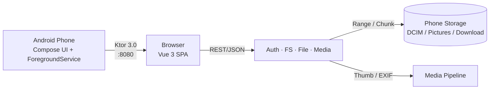

# HcqDrive

**English** | [简体中文](README.zh.md)

[**Try the live web demo →**](https://huangchengqian.github.io/HcqDrive/?demo=1)

**Turn your Android phone into a private LAN cloud.**
Scan a QR code from any browser on the same Wi-Fi — instant access to your
photos, videos, and files. No cloud. No account. No client to install.

Like AirDrop, but for everything. Like Nextcloud, but the phone is the server.

---

## How it works



The phone is the server. The browser is the client. Wi-Fi is the network.

---

## Features

- **One-tap server** — a foreground service keeps the Ktor server alive in
  the background, with a persistent notification showing the pairing code,
  access URL, and live connection count.
- **Browser-only client** — nothing to install on your laptop, tablet, or
  second phone. Scan the QR or type `http://phone-ip:8080`.
- **Secure pairing** — 6-digit code with a 5-minute expiry, per-device
  session tokens, instant revoke from the phone.
- **Full file manager** — browse, search, sort (name/size/date), rename,
  move, copy, delete (with recycle bin), new folder, ZIP bulk-download,
  single-file and chunked uploads.
- **Media-aware** — on-the-fly thumbnails for photos and videos, EXIF
  metadata extraction for JPEGs.

---

## Quick start

### Prerequisites
- Android 7.0+ (API 24+)
- Android Studio Hedgehog or newer (for building the APK)
- Node.js 20+ (only if you want to modify the web UI)

### Run

1. Open the project in Android Studio and click **Run** on a real device.
2. Tap **Start Service** on the phone — a 6-digit pairing code and a QR
   code appear on screen, plus a persistent notification with the access
   URL.
3. On any device on the same Wi-Fi, open the URL (or scan the QR) and
   enter the pairing code. You're in.

### What you should see

- A file browser rooted at your phone's shared storage (`/DCIM`,
  `/Pictures`, `/Download`, …).
- Drag-and-drop upload from the browser to the phone.
- Download with HTTP Range resume — kill the connection mid-transfer and
  pick it back up.

---

## Build the web UI (optional)

The Android app ships the built web assets in `app/src/main/assets/web/`.
You only need to rebuild them when you change `web/src/`.

```bash
cd web
npm install
npm run build
cp -r dist/* ../app/src/main/assets/web/
```

---

## Stack

**Android** — Kotlin 2.0 · Jetpack Compose · Material 3 · Ktor 3.0 (CIO) ·
kotlinx-serialization · ZXing · Apache Commons Compress. No DI framework,
no Room, no Java.

**Web** — Vue 3 · Vite · TypeScript · Tailwind CSS · Pinia · Vue Router.
Responsive across phone / tablet / desktop, full dark mode.

---

## API

A complete contract (19 endpoints) lives in
[`docs/api-contract.md`](docs/api-contract.md). Pair, list, download with
Range, chunked upload, ZIP, thumbnails, EXIF — all there.

```http
POST /api/auth/pair     { "code": "123456", "deviceName": "MacBook" }
GET  /api/fs/list?path=/DCIM
GET  /api/file/raw?path=/DCIM/photo.jpg&Range=bytes=0-1048575
```

---

## Project layout

```
app/        Android app (Compose UI + Ktor server + services)
web/        Vue 3 SPA (Vite + Tailwind)
docs/       API contract and design notes
gradle/     Version catalog (libs.versions.toml)
```

The Android module contains everything needed to ship the APK. The web
module is a standalone Vite project that builds into the Android assets.

---

## Limitations

- The phone must be on the same Wi-Fi network as the client. No relay,
  no tunnel, no cloud — that's the point, and the trade-off.
- No HTTPS. Pairing-code auth still works because the code is short-lived
  and never leaves your LAN, but don't expose the port to the internet.
- Foreground service is required to keep the server alive. On aggressive
  OEMs you may need to disable battery optimisation.

---

## Alternatives

HcqDrive sits in a healthy ecosystem. If it doesn't fit your need, try:

- **[LocalSend](https://github.com/localsend/localsend)** — cross-platform
  file transfer, great for one-off sends.
- **[PairDrop](https://github.com/schlagmichdaniel/PairDrop)** — AirDrop
  in the browser, peer-to-peer via WebRTC.
- **[KDE Connect](https://github.com/KDE/kdeconnect-kde)** — full
  device-integration suite, requires the KDE app on every device.
- **[Syncthing](https://github.com/syncthing/syncthing)** — continuous
  file sync between devices, no central server.

---

## License

[MIT](LICENSE) © 2026 huangchengqian

---

## For contributors

See [`docs/release-process.md`](docs/release-process.md) for how to cut a
release and how to set up the release signing keystore.
The full version history lives in [`CHANGELOG.md`](CHANGELOG.md).
Pre-written announcement copy for V2EX, 少数派, 即刻, HN, and Reddit
lives under [`docs/announcements/`](docs/announcements/).
