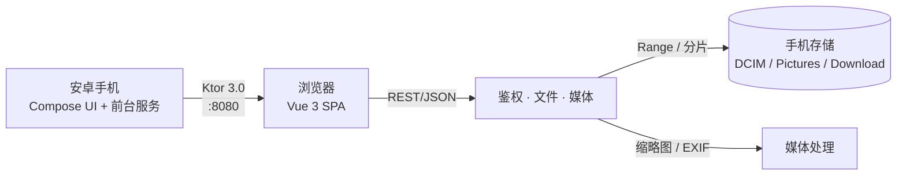

# HcqDrive

[English](README.md) | **简体中文**

> **M1 完整交付** — 安卓局域网云盘,服务端仅运行在安卓,客户端浏览器访问。

把你的安卓手机变成局域网里的私人云盘。同一 WiFi 下的任何设备(电脑/手机/平板)用浏览器就能访问手机里的照片、视频、文件,**无需安装客户端,无需注册账号,数据不上云**。

像 AirDrop,但能传任意大小、任意类型。像 Nextcloud,但服务器就是你的手机。

---

## 工作原理



手机是服务器,浏览器是客户端,WiFi 是网络。

---

## 特性

- **一键启动** — 前台服务保活,通知栏常显配对码 + 访问地址 + 在线连接数
- **纯浏览器客户端** — 电脑、平板、第二台手机都不需要装任何东西,扫码或输入 `http://手机IP:8080` 即用
- **安全配对** — 6 位数字配对码,5 分钟过期;每个设备独立 Token,手机端可即时撤销
- **完整文件管理** — 浏览、搜索、按名称/大小/时间排序,重命名、移动、复制、删除(回收站)、新建文件夹,ZIP 打包下载,单文件 + 分片上传
- **媒体感知** — 自动生成图片和视频缩略图,JPEG 解析 EXIF 元数据

---

## 快速开始

### 环境要求
- Android 7.0+(API 24)
- Android Studio Hedgehog 或更新版本(用于编译 APK)
- Node.js 20+(仅当你需要改 web UI 时)

### 运行

1. 用 Android Studio 打开项目,点击 **Run** 部署到真机。
2. 在手机上点 **启动服务** — 屏幕会出现 6 位配对码和二维码,通知栏会显示访问地址。
3. 在同一 WiFi 下的任何设备,打开那个地址(或扫码)并输入配对码,即可访问。

### 启动后你会看到

- 以手机共享存储为根的文件浏览器(`/DCIM`、`/Pictures`、`/Download` 等)
- 支持浏览器拖拽上传到手机
- 支持 HTTP Range 断点续传 — 传一半断网,重新连接会继续

---

## 重新构建 Web UI(可选)

Android 应用内置的 Web 资源在 `app/src/main/assets/web/`。只有修改 `web/src/` 后才需要重新构建。

```bash
cd web
npm install
npm run build
cp -r dist/* ../app/src/main/assets/web/
```

---

## 技术栈

**Android 端** — Kotlin 2.0 · Jetpack Compose · Material 3 · Ktor 3.0 (CIO) · kotlinx-serialization · ZXing · Apache Commons Compress。无 DI 框架、无 Room、无 Java。

**Web 端** — Vue 3 · Vite · TypeScript · Tailwind CSS · Pinia · Vue Router。手机/平板/桌面三端响应式,完整暗色模式。

---

## API

完整接口契约(19 个端点)见 [`docs/api-contract.md`](docs/api-contract.md)。配对、列表、Range 下载、分片上传、ZIP 打包、缩略图、EXIF 全部覆盖。

```http
POST /api/auth/pair     { "code": "123456", "deviceName": "MacBook" }
GET  /api/fs/list?path=/DCIM
GET  /api/file/raw?path=/DCIM/photo.jpg&Range=bytes=0-1048575
```

---

## 项目结构

```
app/        Android 应用(Compose UI + Ktor 服务 + 后台服务)
web/        Vue 3 SPA(Vite + Tailwind)
docs/       API 契约和设计文档
gradle/     版本目录(libs.versions.toml)
```

Android 模块是完整的 APK 工程。Web 模块是独立的 Vite 项目,构建产物复制到 Android assets。

---

## 已知限制

- 手机和客户端必须在同一 WiFi 下。无中继、无穿透、无云端 — 这是特性,也是取舍
- 无 HTTPS。配对码机制能保证安全(短时效、不出局域网),但**不要把端口暴露到公网**
- 依赖前台服务保活。在一些激进的国产 ROM(小米、OPPO、vivo)上,可能需要在电池优化设置里把 HcqDrive 加白名单

---

## 替代方案

HcqDrive 不是唯一选择。如果你有不同的需求,可以看看:

- **[LocalSend](https://github.com/localsend/localsend)** — 跨平台文件传输,适合一次性互传
- **[PairDrop](https://github.com/schlagmichdaniel/PairDrop)** — 浏览器里的 AirDrop,基于 WebRTC 点对点
- **[KDE Connect](https://github.com/KDE/kdeconnect-kde)** — 完整设备互联套件,需要在每台设备装 KDE 应用
- **[Syncthing](https://github.com/syncthing/syncthing)** — 设备间持续文件同步,无中心服务器

---

## 许可证

[MIT](LICENSE) © 2026 huangchengqian

---

## 给贡献者

发版流程和 release 签名密钥的设置方式见 [`docs/release-process.md`](docs/release-process.md)。
完整版本历史见 [`CHANGELOG.md`](CHANGELOG.md)。
